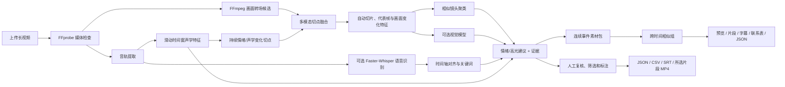

# AI 视频素材分析与前期标注工作流

StoryForge 的主要定位是“剪辑前助手”，不是替用户自动决定成片。系统保留原视频，生成可复核的片段、相似镜头组、语音、内容和情绪建议，用户修改标签并选择要导出的片段。

## 工作流



## 本地能力与模型能力的边界

| 能力 | 默认实现 | 是否需要训练或联网 |
|---|---|---|
| 视频时长、分辨率、音轨 | ffprobe | 否 |
| 转场切片 | FFmpeg scene score | 否 |
| 缩略图、亮度、主色、画面变化 | FFmpeg + Pillow + NumPy | 否 |
| 相似镜头分组 | RGB 直方图余弦相似度 | 否 |
| 音频能量、峰值 | PCM 波形统计 | 否 |
| 音频情绪变化切点 | RMS、频谱重心、过零率、文本情绪的持续窗口融合 | 否；文本情绪需要转写 |
| 原声转文字 | faster-whisper | 本地推理；首次取得模型可能需联网 |
| 人物、物体、动作、具体场景 | OpenAI-compatible 视觉模型适配器 | 可选 |
| 情绪与高光建议 | 文本关键词 + 音频能量 + 画面变化规则 | 否 |

默认实现不需要自行训练模型。它适合先验证工作流和交互价值。后续积累了用户修正标签后，再用 `reviewed_analysis.json` 形成数据集，训练或微调专门的镜头分类/情绪模型才有意义。

## 启动与使用

```powershell
streamlit run app.py
```

首页操作顺序：上传视频 → 调整切镜与聚类阈值 → 开始分析 → 查看缩略图和时间轴 → 修改人工标签 → 勾选片段 → 导出 MP4 或下载结构化结果。

也可以直接使用命令行：

```powershell
# 完全离线，不转写语音
python analyze.py .\my-video.mp4 --no-transcribe

# 本地 Whisper 转写
python analyze.py .\my-video.mp4 --language zh

# 调低阈值会增加声音变化切点；持续 2 个窗口可过滤瞬时噪声
python analyze.py .\my-video.mp4 --language zh `
  --audio-window 2 --audio-hop 1 `
  --audio-change-threshold 0.45 --emotion-persistence-windows 2

# 同时调用已经配置的视觉模型
python analyze.py .\my-video.mp4 --language zh --vision
```

每次分析写入 `artifacts/analysis/<analysis_id>/`：

```text
analysis.json          完整机器可读分析结果
segments.csv           可在表格软件中继续标注的镜头清单
transcript.srt         只来自原视频语音的字幕；无语音时为空
audio_timeline.json    每个音频窗口的声学/文本情绪特征及候选切点
packages/
  package_manifest.json 所有素材包及跨时间相似组
  package_001/
    package.json         内容、情绪、证据、置信度和待复核状态
    preview.mp4          素材包连续预览
    contact_sheet.jpg    包内镜头联系表
    transcript.srt      相对素材包时间轴的原声字幕
    clips/              保留原声的独立小片段
packages.zip            可从 Web 一次下载的全部素材包
events.jsonl           分析事件与降级记录
thumbnails/            每个片段的代表帧
reviewed_analysis.json 用户在 Web 中保存后的复核结果
selection/             用户勾选片段和拼接出的 MP4
```

## 接入免费或本地视觉模型

适配器使用 OpenAI-compatible Chat Completions 多模态格式。服务端只要接受文本和 `image_url` 数据 URL，并返回 JSON 即可：

```powershell
$env:STORYFORGE_BASE_URL="http://127.0.0.1:8000/v1"
$env:STORYFORGE_API_KEY="local-or-provider-key"
$env:STORYFORGE_VISION_MODEL="your-vision-model"
streamlit run app.py
```

模型输出结构：

```json
{
  "summary": "画面中一名骑行者经过城市街道",
  "tags": ["人物", "自行车", "城市街道", "运动镜头"],
  "confidence": 0.82
}
```

视觉模型调用失败时，单个镜头自动退回本地特征，并在该镜头的 `visual_tags` 中记录失败类型，不中断整个视频分析。

## 结果解释

- `cluster_id` 只表示画面外观相似，不等同于“同一个事件”或“同一个游戏”。
- `suggested_emotion` 是前期标注建议，`emotion_evidence` 会说明依据；用户应写入 `review_emotion` 作为最终标签。
- `content_confidence=0.2` 且出现“未识别具体语义”表示没有语音或视觉模型证据，系统没有猜测画面内容。
- 场景检测阈值越小越敏感；相似度阈值越高，聚类越严格。
- 音频候选切点综合文本情绪变化、持续能量变化、频谱变化和语音状态；`boundary_reasons` 与 `boundary_score` 会保存在片段中。
- 默认要求变化至少持续 2 个窗口。一个窗口的爆音或碰撞声不会单独触发切片；确有需要时可把持续窗口数调为 1。
- 关闭 Whisper 后仍可依据声学变化切片，但不能利用转写文本中的“兴奋→紧张”等情绪变化。
- 素材包只合并时间连续且画面组/情绪/关键词足够一致的片段。画面转场且镜头组不同，或出现持续情绪/声学变化时会开启新包。
- 非连续素材不会被拼成同一事件包；外观或标签相近时仅共享 `similar_group_id`，供用户筛选比较。
- `needs_review=true` 表示内容与情绪综合置信度较低，不会强行给出确定性语义。
- 用户修改“保留、人工情绪、人工内容标签”后，可点击“按人工标注重建素材包”；未保留片段会被排除，人工标签和情绪优先于 AI 建议。

## 下一步模型训练建议

先用真实视频收集用户修改后的标签，至少包括片段边界、内容类别、情绪、是否保留和高光评分。达到稳定数量后再评估：镜头边界微调、视觉 embedding 聚类、音视频联合情绪分类和个性化高光排序。训练集必须按原视频分组切分，避免同一视频的相邻镜头同时进入训练集和测试集导致虚高指标。
