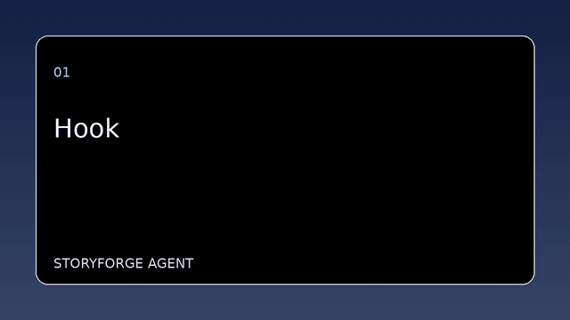

# Verified StoryForge demo



- Full video: [`output/demo.mp4`](output/demo.mp4)
- Quality report: [`output/quality_report.json`](output/quality_report.json)
- Output structure examples: [`output/`](output/)
- Minimal reusable inputs: [`assets/`](assets/)

Command:

```bash
python cli.py --topic "How AI helps creators" --duration 16 --language en
```

Verification result:

- 24/24 unit, automation, and FFmpeg integration tests passed.
- The workflow completed with status `completed`.
- All scenes had valid assets.
- Expected duration: 16.307 seconds.
- Actual duration: 16.303 seconds.
- Duration delta: 0.004 seconds.

`output/demo.mp4` is the offline baseline sample. The current workflow additionally burns subtitles into the final MP4 and accepts mixed image/video assets. A video-material example can be generated with:

```bash
python cli.py --topic "AI creator workflow" --duration 12 --language en --assets-dir examples/assets
```

The visual selection is deliberately lightweight and local; semantic visual scoring, timeline editing, and generation models remain future enhancements.

Stage-two shot detection and vertical crop demo:

```bash
python cli.py --topic "AI creator workflow" --duration 12 --language en \
  --assets-dir examples/assets --aspect-ratio 9:16 --fit-mode crop \
  --scene-threshold 0.15 --transition-seconds 0.35
```
